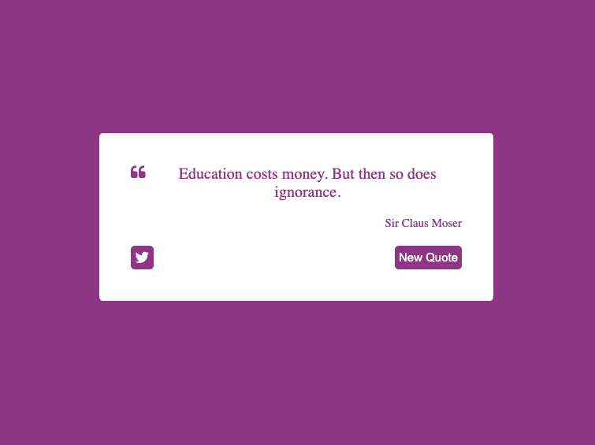

<h1 align="center">💬 Random Quote Machine 💻</h1>

  

<h2>
This project is a simple poge where it is possible to fetch random phrases from an API.
</h2>

## 💻 Project

This project consists of a random quote machine with the following funcionalities:

<ul>
  <li>
    Click the "New Quote" button to fetch from the API  a random quote.
  </li>
  <li>
    A link to Twitter.
  </li>
 </ul>

## 🚀 Technologies

This project was developed using the following technologies:

- React
- TypeScript
- Redux
- SASS
- Git

## 🔖 How to access it

- Download the zip file, download the modules needed with <code>npm install</code>, run <code>npm run dev</code> on the terminal and access localhost on a browser.
